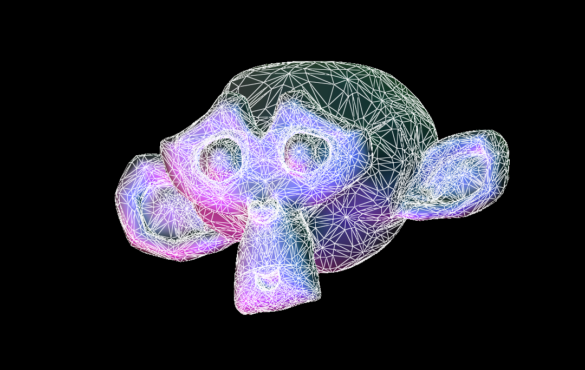
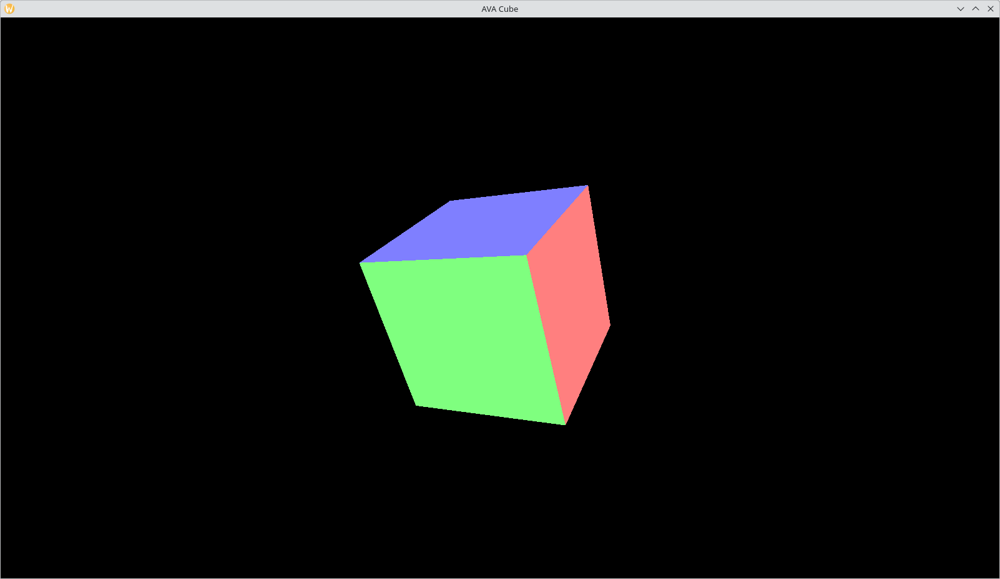
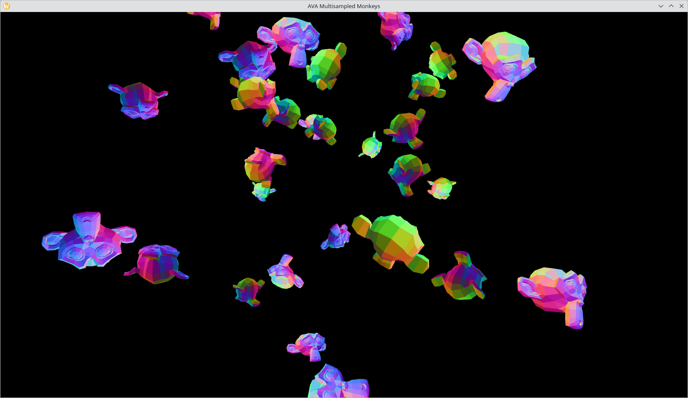
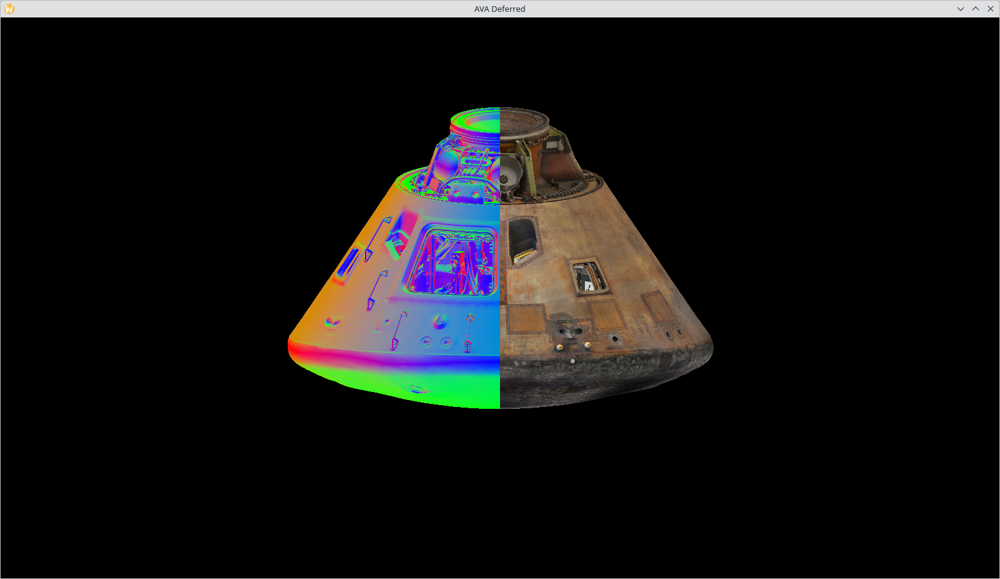
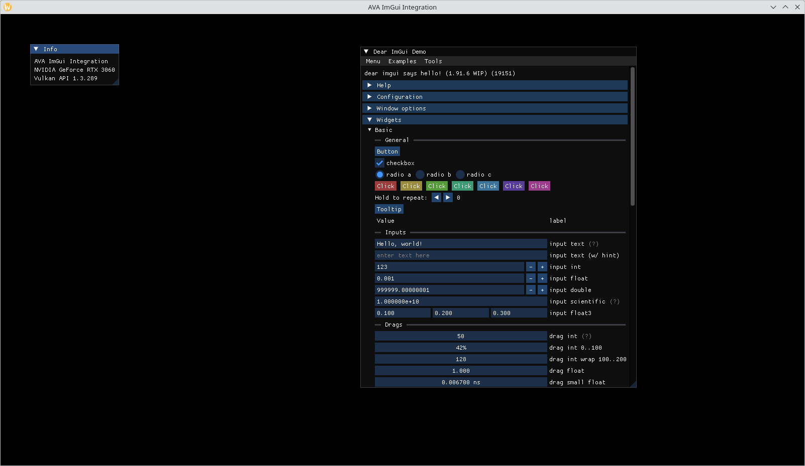
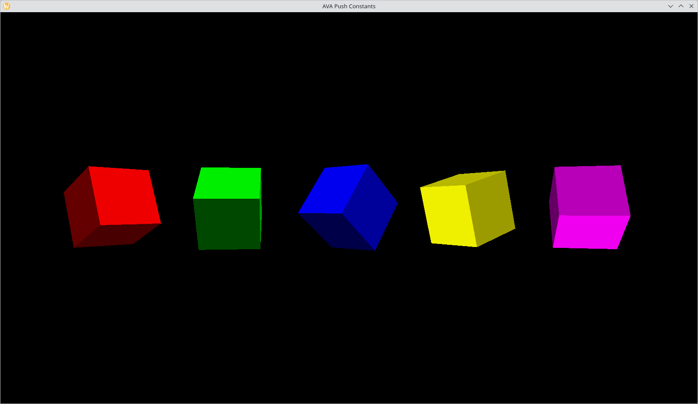
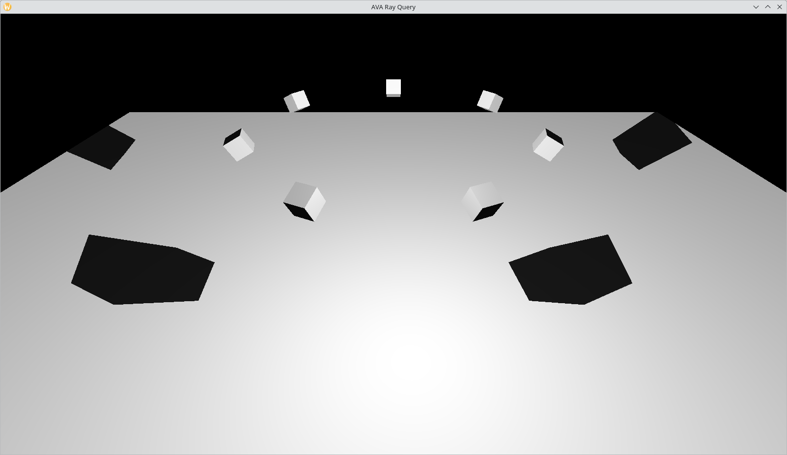
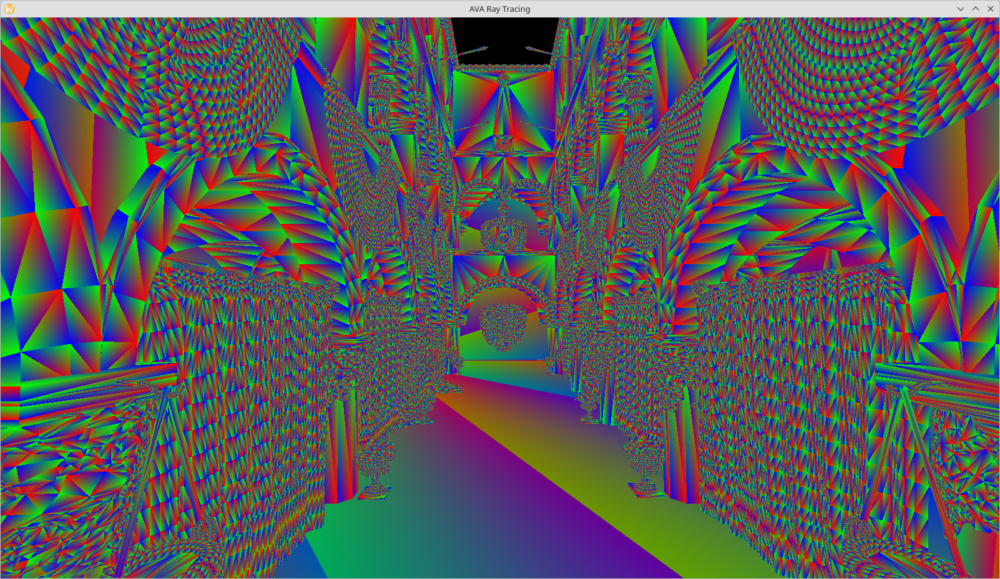

# AVA - Another Vulkan Abstraction

Aim: To be an abstraction of Vulkan that is simpler than dealing with `vulkan.h`/`vulkan.hpp` normally, somewhere between OpenGL and Vulkan

You will still need to provide a windowing system, input and main game loop (unless using the example framework)

## Features

* Abstraction over Vulkan features without sacrificing control
* CreateInfo configuration to simplify creation of the initial Vulkan state
* [Slang](https://shader-slang.com/) shader compilation support. All examples are written in Slang, though anything that compiles to SPIR-V can be used
* Supporting latest Vulkan features such as Acceleration Structures and Ray Tracing
* Installation using CMake so AVA can be used in other projects system-wide
* Both unmanaged and RAII-style objects
* Textures and images
* Samplers
* Vertex buffer objects, index buffer objects and combined VIBO
* Vertex attribute objects to bridge knowledge of OpenGL to Vulkan
* Framebuffers
* Render passes
* Geometry and tesselation shaders
* Compute shaders
* Shader reflection using [SPIRV-Cross](https://github.com/KhronosGroup/SPIRV-Cross) to get layout bindings and push constants at runtime

## Examples

| Example              | Screenshot                                                                                                                             |
|----------------------|----------------------------------------------------------------------------------------------------------------------------------------|
| Tessellation         |  <br/> Showing support for tessellation and geometry shaders using PN triangles |
| Cube                 |  <br/> Simple rotating cube                                                                    |
| Multisampled Monkeys |  <br/> Multisampling render targets with rotating Suzanne monkeys         |
| Deferred             |  <br/> Drawing to multiple render targets and compositing them in another shader       |
| ImGui Integration    |  <br/> ImGui integration into AVA                                    |
| Push Constants       |  Push constants changing the color and MVP of each cube                     |
| Ray Query            |  <br/> Ray queries using Vulkan's acceleration structure extension                    |
| Ray Tracing          |  <br/> Sponza scene, rendered using Vulkan's ray tracing extensions               | 

## Building

AVA requirements:

* Vulkan SDK (tested with 1.3.296.0)
* VulkanMemoryAllocator (should be included with the Vulkan SDK)
* [VulkanMemoryAllocator-Hpp](https://github.com/YaaZ/VulkanMemoryAllocator-Hpp)

AVA Example requirements:

* glm
* glfw3

Build with CMake or your IDE of choice (that supports CMake)

```shell
cmake -B build
cmake --build build
```

Libraries fetched with CMake:

* [vk-bootstrap](https://github.com/charles-lunarg/vk-bootstrap)
* [SPIRV-Cross](https://github.com/KhronosGroup/SPIRV-Cross)